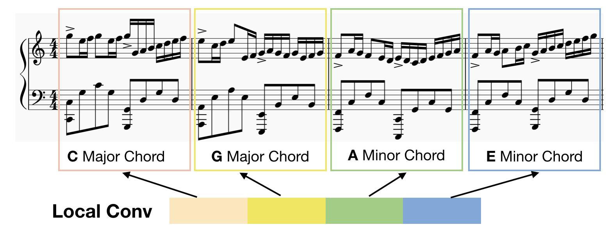
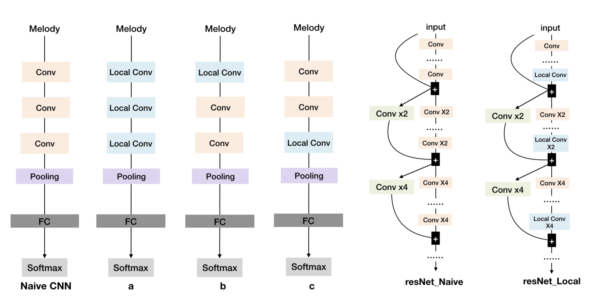

# Abstract

With the development of deep learning, more and more neural networks are applied to the music generation task especially the recurrent neural networks like LSTM. And recent work demonstrates that the feedforward model like CNN achieves a parallel result in music generation task. However, we find CNN model cannot surpass the performance of LSTM because CNN model is lack of temporal feature. Besides, the quality of music drops as the length of the sequence increases. Especially for a larger dataset or a harder task like polyphonic music generation. Then we find a simple change to CNN -- Locally Connected Convolutional CNN can remarkably boost the performance of existing CNN architecture for music generation task. Locally Connected CNN provides the CNN a temporal feature which enables CNN model to generate better music than both RNN model and naive CNN model. We analyze why Locally Connected CNN is much better at handling sequence task than other models by experiment, and we also use human behavior experiment to prove our model’s generated music is better. 
# Models
### Locally Connected CNN
Locally Connected CNN
The reason why we introduce Locally Connected Convolutional layer (Local Conv) to sequence problem is that we believe different parts in a specific sequence should not share the same kernel. Each timestep of the input sequence should have different characteristics. For example, the beginning note in a music sequence usually differs from the last note. The first note of a sequence usually contains notes that belong to the primary chord, but the last note in music contains notes come from Fifth Chord or Subdominant Seventh Chord. As Figure below shows, it’s better for the first C major chord bar and the last E minor chord bar use different CNN kernel (Local Conv).
 
We use a simple 3-layer CNN to compare the naive CNN model and Locally Connected version CNN. From the Figure below, we compare 3 main types of Locally Connected version CNN with naive CNN. We can replace all the general convolutional blocks by Local Conv blocks like type **_a_**. As Taigman mentioned in Deepface (Taigman et al. 2014), Local Conv brings more weights to CNN model. It’s necessary to mix Local Conv together with naive CNN model to reduce this burden. So, we designed other two
structure of CNN as **_b_** and **_c_**. In architecture **_b_**, we put the Local Conv in the first layer of the CNN architecture, there will be less weights in model because of the size of d tends to be smaller in the first layer, but this will provide the model with a better perspective field.

For resNet, we can divide the resNet into different blocks according to the feature map size, and there are two main type of CNN layers in resNet architecture: one is the ordinary CNN layer (yellow rectangle) and another is the transition CNN layer in order to down-sample the feature (green rectangle), plus, we use blue rectangle to represent Local Conv layer. We designed one effective architecture to utilize the Local Conv in different resNet blocks. For deep resNet, it is impractical to replace all the ordinary CNN layer with Local Conv layer. Therefore, Local Conv layers should be used as little as possible. Referencing the principle of previous design of simple CNN and resNet basic blocks, we put the Local Conv layer to the last layer of each basic resNet block like res-local as Figure below shows.

 

# Result
### Monophonic Music Generation Result(mp3)
Naive 3 layer CNN Model:
 
LocalConv 3 layer CNN Model:
 
Naive resNet Model:
 
LocalConv resNet Model:
 
LSTM Model:
 

### Polyphonic Music Generation Result(mp3)
LocalConv 3 layer CNN Model:

LSTM Model:


### Monophonic Music Generation Result(music sheet)

| LocalConv 3 layer CNN Model | Naive 3 layer CNN Model | LSTM Model |
| :---: | :---: | :---: |
|   |   |   |

### Polyphonic Music Generation Result(music sheet)

| LocalConv 3 layer CNN Model | Naive 3 layer CNN Model | LSTM Model |
| :---: | :---: | :---: |
|   |   |   |

### Training Result

For monophonic music generation task, we get the result as followed.
We can find the Local Conv model distinctly improve the performance of naive CNN model not only for simple CNN or complex CNN like resNet. Although the drawback of Local Conv model is that it brings more weights to the original model, the performance of Local Conv CNN ex-ceeds LSTM in 3 aspects:1. The speed of Local Conv model is 3~4 times faster than LSTM model. 2. CNN model converge faster than the LSTM model. 3. For large dataset like Wikifonia, the loss of Local Conv resNet is much less than LSTM. Usually, a smaller loss usually means a better structure of music in music generation task.

| Model | Loss | Speed （ms/epoch)| Converge Epoch | Size/M |
| :---: | :---: | :---: | :---: | :---: |
| CNN\_a | 0.0103 | 9.30 | 15 | 1.39 |
| CNN\_b | 0.4412 | 9.03 | 61 | 0.18 |
| CNN\_c | 0.0080 | 9.91 | 15 | 1.16 |
| CNN\_Naive\_Large | 0.7477 | **9.00** | -1 | 0.18 |
| CNN\_Naive | 1.2782 | 9.07 | -1 | **0.04** |
| resNet20\_Naive | 0.0052 | 29.48 | 44 | 0.53 |
| resNet20\_LocalConv | **0.0044** | 46.32 | **8** | 12.41 |
| LSTM | 0.0061 | 81.71 | 22 | 1.15 |

# Application: XiaoJoy Project
Explore the possibility that human composer create music together with AI. 
<iframe width="560" height="315" src="https://www.youtube.com/embed/M1_H2c-XFQ0" frameborder="0" allow="autoplay; encrypted-media" allowfullscreen></iframe>
