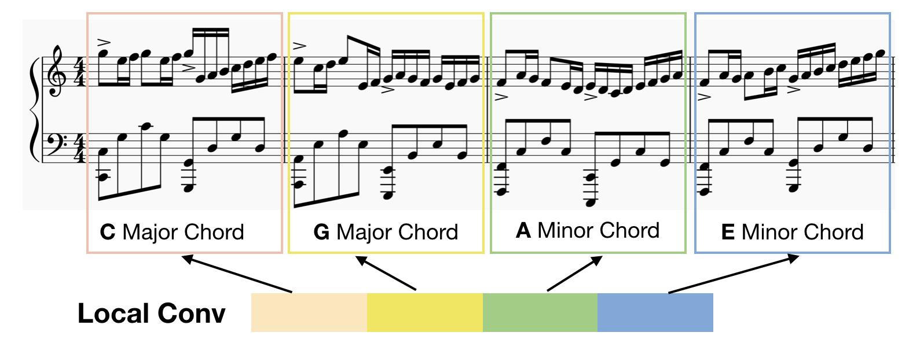
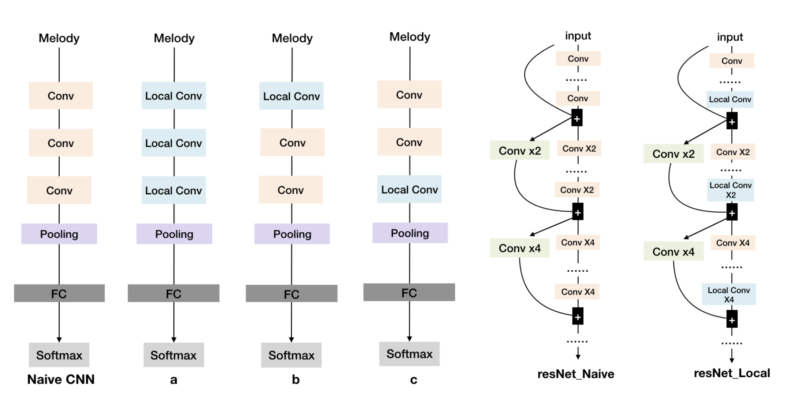
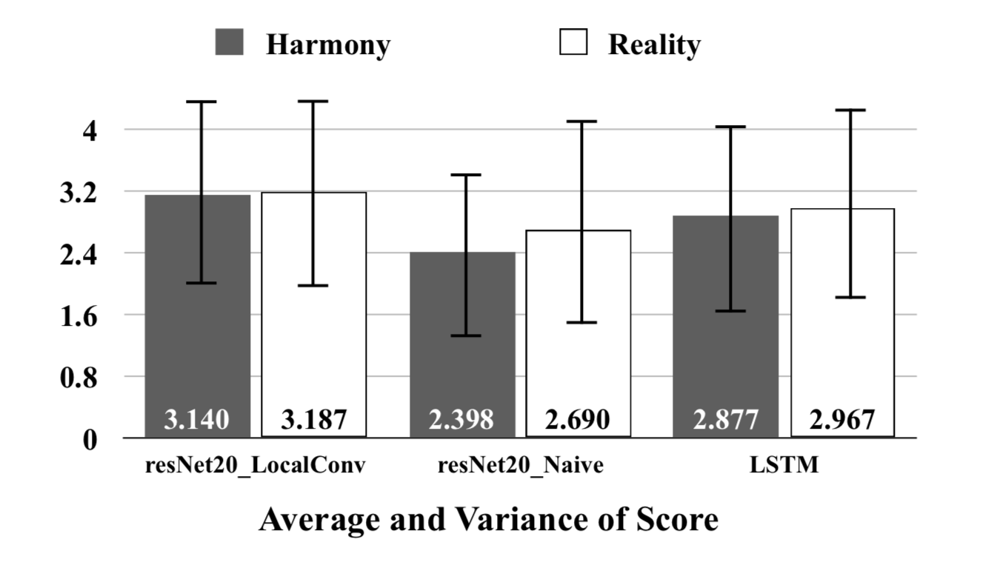
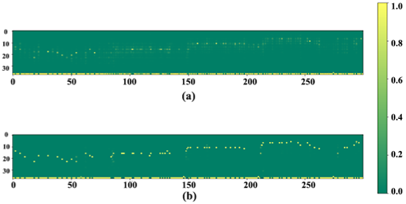
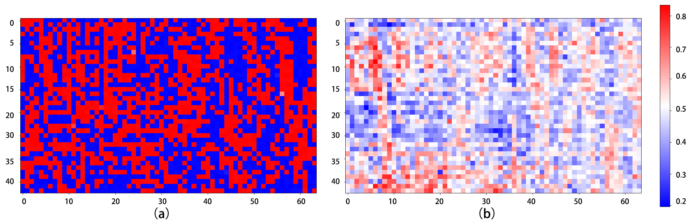

# Overview

With the development of deep learning, more and more neural networks are applied to the music generation task especially the recurrent neural networks like LSTM. And recent work demonstrates that the feedforward model like CNN achieves a parallel result in music generation task. However, we find CNN model cannot surpass the performance of LSTM because CNN model is lack of temporal feature. Besides, the quality of music drops as the length of the sequence increases. Especially for a larger dataset or a harder task like polyphonic music generation. Then we find a simple change to CNN -- Locally Connected Convolutional CNN can remarkably boost the performance of existing CNN architecture for music generation task. Locally Connected CNN provides the CNN a temporal feature which enables CNN model to generate better music than both RNN model and naive CNN model. We analyze why Locally Connected CNN is much better at handling sequence task than other models by experiment, and we also use human behavior experiment to prove our model’s generated music is better. 

# Application: XiaoJoy Project
Explore the possibility that human composer create music together with AI. 

	<iframe width="560" height="315" src="https://www.youtube.com/embed/M1_H2c-XFQ0" frameborder="0" allow="autoplay; encrypted-media" allowfullscreen>
    </iframe>

# Models
### Locally Connected CNN
Locally Connected CNN
The reason why we introduce Locally Connected Convolutional layer (Local Conv) to sequence problem is that we believe different parts in a specific sequence should not share the same kernel. Each timestep of the input sequence should have different characteristics. For example, the beginning note in a music sequence usually differs from the last note. The first note of a sequence usually contains notes that belong to the primary chord, but the last note in music contains notes come from Fifth Chord or Subdominant Seventh Chord. As Figure below shows, it’s better for the first C major chord bar and the last E minor chord bar use different CNN kernel (Local Conv).

    

We use a simple 3-layer CNN to compare the naive CNN model and Locally Connected version CNN. From the Figure below, we compare 3 main types of Locally Connected version CNN with naive CNN. We can replace all the general convolutional blocks by Local Conv blocks like type **_a_**. As Taigman mentioned in Deepface (Taigman et al. 2014), Local Conv brings more weights to CNN model. It’s necessary to mix Local Conv together with naive CNN model to reduce this burden. So, we designed other two
structure of CNN as **_b_** and **_c_**. In architecture **_b_**, we put the Local Conv in the first layer of the CNN architecture, there will be less weights in model because of the size of d tends to be smaller in the first layer, but this will provide the model with a better perspective field.

For resNet, we can divide the resNet into different blocks according to the feature map size, and there are two main type of CNN layers in resNet architecture: one is the ordinary CNN layer (yellow rectangle) and another is the transition CNN layer in order to down-sample the feature (green rectangle), plus, we use blue rectangle to represent Local Conv layer. We designed one effective architecture to utilize the Local Conv in different resNet blocks. For deep resNet, it is impractical to replace all the ordinary CNN layer with Local Conv layer. Therefore, Local Conv layers should be used as little as possible. Referencing the principle of previous design of simple CNN and resNet basic blocks, we put the Local Conv layer to the last layer of each basic resNet block like res-local as Figure below shows.

 

# Result
### Monophonic Music Generation Result(mp3)

| Naive 3 layer CNN Model | LocalConv 3 layer CNN Model |
| :---: | :---: |
|  |  |

|Naive resNet Model |LocalConv resNet Model|
| :---: | :---: |
| ||

|LSTM Model|
| :---: |
||

### Polyphonic Music Generation Result(mp3)

|LocalConv 3 layer CNN Model|LSTM Model|
| :---: | :---: |
|||

### Monophonic Music Generation Result(music sheet)

| LocalConv 3 layer CNN Model | Naive 3 layer CNN Model | LSTM Model |
| :---: | :---: | :---: |
|   |   |   |

### Polyphonic Music Generation Result(music sheet)

| LocalConv 3 layer CNN Model | Naive 3 layer CNN Model | LSTM Model |
| :---: | :---: | :---: |
|   |   |   |

### Training Result

For monophonic music generation task, we get the result as followed.
We can find the Local Conv model distinctly improve the performance of naive CNN model not only for simple CNN or complex CNN like resNet. Although the drawback of Local Conv model is that it brings more weights to the original model, the performance of Local Conv CNN ex-ceeds LSTM in 3 aspects:1. The speed of Local Conv model is 3~4 times faster than LSTM model. 2. CNN model converge faster than the LSTM model. 3. For large dataset like Wikifonia, the loss of Local Conv resNet is much less than LSTM. Usually, a smaller loss usually means a better structure of music in music generation task.

| Model | Loss | TimeCost （ms/event)| Converge  Epochs | Weights (million) |
| :---- | :---: | :---: | :---: | :---: |
| CNN\_a | 0.0103 | 9.30 | 15 | 1.39 |
| CNN\_b | 0.4412 | 9.03 | 61 | 0.18 |
| CNN\_c | 0.0080 | 9.91 | 15 | 1.16 |
| CNN\_Naive\_Large | 0.7477 | **9.00** | -1 | 0.18 |
| CNN\_Naive | 1.2782 | 9.07 | -1 | **0.04** |
| resNet20\_Naive | 0.0052 | 29.48 | 44 | 0.53 |
| resNet20\_LocalConv | **0.0044** | 46.32 | **8** | 12.41 |
| LSTM | 0.0061 | 81.71 | 22 | 1.15 |

### Human Behavior Experiment
As for monophonic music generation task, we randomly select 10 generated music from each model’s generated result: our LSTM model, resNet20 Naive model and resNet20 LocalConv model. We clip each music to 8 bar length. Via a survey website, 45 testers are required to judge the harmony and reality of the music.
From the User Study Result. The dark grey and grey square bar represents user’s harmony and reality average score respectively. All the scores range from 0-5.

    

We also uploaded all the data we use to do this human behavior experiment. 

[Google Drive](https://drive.google.com/open?id=1MoeVKZaNtENxdXeWNnMcl-I6RcD2O3Nd)

It contains music samples generated by our resNet20\_Naive, resNet20\_LocalConv and LSTM models.

# Analyse
We visualize the last softmax layer’s result in Figure below to compare the difference of the Local Conv CNN model and CNN model, according to Binary-Valued Gates (Li et al. 2018.), if the model ensures the generated result, this feature(Binary-Valued) will prevent model generating some wandering music result. So, we compare the softmax layer’s output of different models, and we find the Local Conv model can generate a “music like” result because of its more 1,0 values.

    

Output comparison between resNet20_Naive and resNet20_LocalConv model. The subplot (a) shows the output of resNet20_Naive model, and (b) shows the output of resNet20_LocalConv model. The vertical and horizontal axes represent note pitch and time, respectively. For a particular position, a brighter color indicates the model has higher confidence, or in other words, has lower perplexity. Obviously, local-conv structure helps model generate more precise predictions.
We let the model generate 1000 steps of music events and visualize the softmax layer’s output of our resNet20_Naive and resNet20_LocalConv model. Both of these models are trained on the Bach dataset. We calculated the average confidence for each output dimension when it is chosen by softmax function in Figure above. We find Local Conv model generates more confident prediction.

The same conclusion can be inferred in a different reverse method. Which is called Activation Maximization.

In a CNN, each Conv layer has several learned template matching filters that maximize their output when a similar template pattern is found in the input. First Conv layer is easy to interpret: simply visualize the weights as an image. But subsequent Conv filters operate over the outputs of previous Conv filters (which indicate the presence or absence of some templates), making them hard to interpret.

The idea behind activation maximization is simple in hindsight - Generating an input image that maximizes the filter output activations. i.e., we compute

$$
\frac{\alpha ActivationMaximizationloss}{\alpha input}
$$

and use this estimate to update the input. ActivationMaximization loss (Kotikalapudi et al. 2017) outputs small values for large filter activations (we are minimizing losses during gradient descent iterations). This allows us to understand what sort of input patterns activate a particular filter. For example, there could be an eye filter that activates for the presence of the eye within the input image.

Similarly, in music generation task, we generate an input that maximizes the final softmax layer output corresponding to each note pitch class and finally get 38 input-expectations for each model. We visualize one of 38 results in Figure below.

Figure above is Comparison of two models’ input expectations on a particular output pitch. (a) and (b) is corresponding to resNet20_Naive and resNet20_LocalConv respectively. The vertical and horizontal axes represent note pitch and time, respectively. For a particular position, red color indicates the model has higher confidence about what kind of input it expects.

It’s very impressive that models with and without local convolution have very distinctive input expectation. Figure 10 shows an example of two models’ input expectations on a same note pitch. We can notice that resNet20_ Naive seems to have a mess expectation on what kind of input should lead to the chosen pitch, while resNet20_LocalConv’s expectation is binarized.

The main difference between naive CNN and CNN with locally connected convolutional layers is that the latter model builds a separate filter for each position and these filters don’t share the same weight. In this way, the latter model’s kernels are enabled to pay attention to some subtle nuances of spatial (temporal in our task) arrangement, so more ‘affirmative’ to its task. From visualization, we ensure this assumption holds the water.

